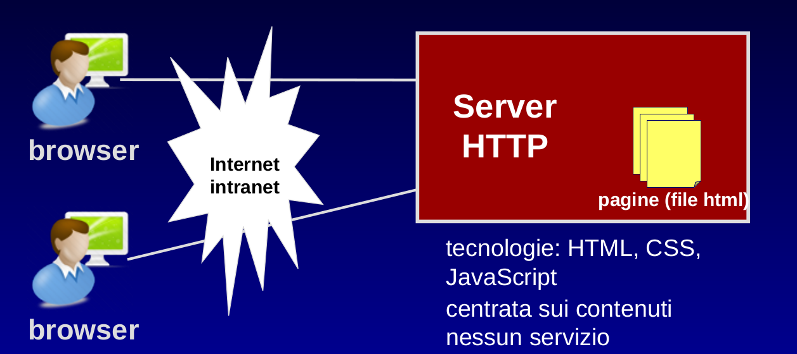
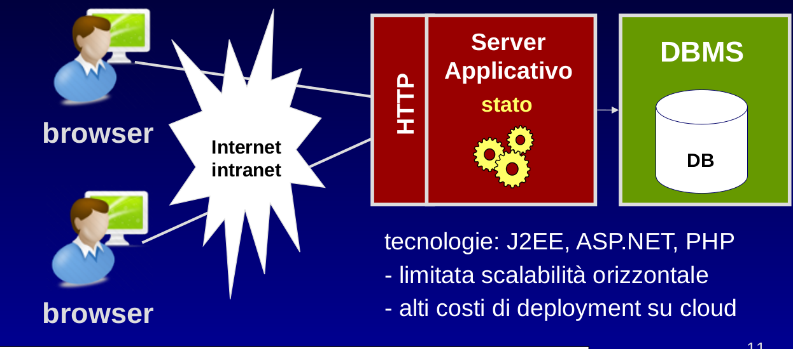
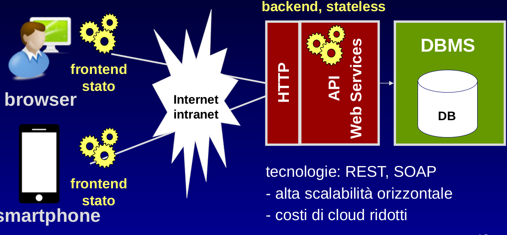

# Architettura client server

Le 3 idee fondamentali del concetto di internet:

1. __HTTP__: protocollo a livello applicativo
2. __URL__: sistema di indirizzamento
3. __HTML__: linguaggio per i documenti

## Terminologia e architettura

Una __risorsa__ è una qualsiasi informazione (file, dato) accessibile su un server, il server è colui che fornisce le
risorse al client, che le richiede.

Esistono sono fondamentalmente 3 macro tipologie di architetture per applicazioni su web:

1. Siti statici
2. Applicazioni web a 3 livelli
3. Applicazioni client-server con API

### Contenuti statici

Il server HTTP _serve_ direttamente i file al client (solitamente un browser), le tecnologie utilizzate sono statiche.
L'architettura è incentrata sui contenuti.

### Applicazione a 3 livelli

Il server HTTP comunica con i client e con lo strato applicativo, questo è scritto in un linguaggio lato server (J2EE,
Python, PHP) e si occupa di gestire le richieste, dialogare con il database e creare la risposta.
La soluzione ha un problema di scalabilità orizzontale perché lavora sulle sessioni a livello del server e quindi scala
bene verticalmente (aumentando le risorse) ma non orizzontalmente (duplicando l'applicazione per smistare il traffico su
più macchine) e questo si traduce in alti costi di distribuzione su cloud.

### Applicazione con API

Una parte della logica applicativa è spostata sul client, con tecnologie di frontend (nella maggior parte dei casi in
Javascript) che mantengono lo stato della sessione ed effettuano richieste al backend stateless.
Questo è formato da API implementate secondo lo standard REST e gestisce le transazioni sul DB.
Questa modalità consente di alleggerire il server da una parte del lavoro affidata al frontend e consente di scalare
facilmente orizzontalmente riducendo i costi di deployment.

## Server Web

- Apache HTTP Server (open source, il più diffuso)
- Microsoft Internet Information Services
- Google Web Server (versione di apache modificata)
- nginx (open source, bassa impronta di memoria, in rapida diffusione)

I principali server applicativi per J2EE sono Apache Tomcat, Jetty e Netty

Il server web offre una serie di servizi:

- HTTP verso il client (con autenticazione e autorizzazione)
- Gestione delle risorse sul file system
- Gestione delle applicazioni
- Logging
- Caching

## Browser web

- Effettua richieste HTTP
- Renderizza le risposte
- Effettua caching locale

## Deployment di un sito statico

### Deployment su server dedicato

In questo caso il stio va installato su un server in rete dell'organizzazione, è necessario rendere il server
accessibile dall'esterno, per fare ciò bisogna assicurarsi di avere un indirizzo IP pubblico statico.
E' necessario inoltre istruire il router a inoltrare la richiesta (__NAT__) in ingresso dall'esterno verso l'indirizzo e
la porta del server su cui gira il server http.
Poi bisogna acquistare un dominio e puntare i DNS del dominio sull'IP pubblico della rete.

La soluzione permette una gestione completa ma è svantaggiosa perché obbliga l'organizzazione a dover gestire tutte le
problematiche di amministrazione del server come l'installazione, l'aggiornamento, la gestione della sicurezza, la
gestione delle copie di backup, il disaster recovery, il downtime, la velocità di collegamento...

### Hosting presso provider cloud

Lo spazio è acquistato presso un provider (AWS, Google Cloud, Microsoft Azure) che nella maggior parte dei casi offre il
servizio di acquisto del dominio e collega automaticamente i DNS.
A questo punto non resta che caricare i file del sito web sulla macchina remota utilizzando protocolli ftp o sftp.