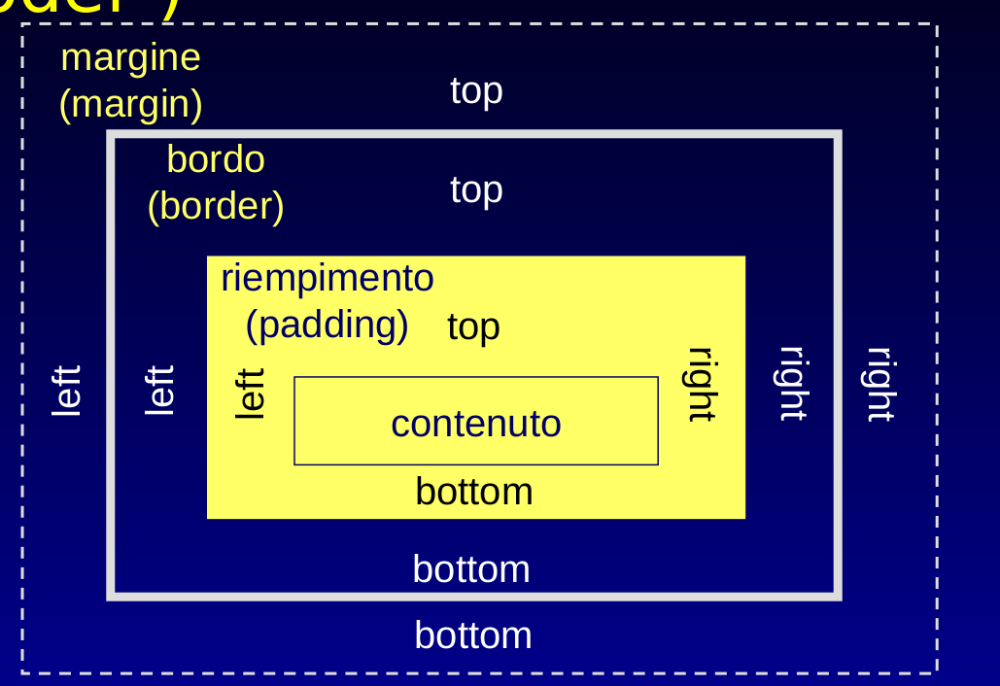

# CSS

__Cascading Style Sheets__, nasce con l'boettivo di specificare caratteristiche di formattazione per i riquadri di una pagina XHTML.

Il CSS è basato su __regole__, una regola deve contenere un riferimento al riquadro da formattare (__selettore__), una lista di __dichiarazioni__ composte da una __proprietà__ e il __valore__ da attribuirgli.

```css
h2 {
    color: green;
    font-size: 14px;
}
```

Sintassi: `<selettore> { <proprietà>: <valore>; altraProprieta: valore;}`

I commenti in CSS si delimitano con `/* */`

Per fare riferimento ad un URI esiste una sintassi particolare: `url("sfondo.jpg")`

## Selettori

Un selettore è un indicatore dell'elemento (o insieme di elementi) html a cui applicare le regole di stile contenute tra parentesi quadre. Esistono diversi modi per selezionare un elemento:

### Selettori semplici

- Nome dell'elemento (tag): es. `img { border: 1px; }`
- In base all'attributo id:
<br>es. volendo selezionare un div `<div id="esempio">` la sintassi css è `#esempio {}` o `div#esempio {}`
- In base all'attributo classe: `.nomeclasse { }` o `p.nomeclasse {} `, il primo seleziona tutti gli elementi che hanno la classe `nomeclasse`, il secondo solamente i paragrafi.

### Pseudo-classi

Le pseudoclassi sono selettori utili per classificare elementi dinamicamente in base a condizioni che si  verificano a livello di azioni che l'utente compie sull'interfaccia.

Sintassi: `<selettore>:<pseudo classe>`. Ad esempio se si vuole indicare un comportamento per i link quando vengono attraversati dal mouse si può utilizzare la classe _hover_:

```css
a:hover {
    color: red;
}
```

### Selettori contestuali

Sono selettori che consentono di distinguere gli elementi in base alla loro posizione nel DOM, costituiti da un selettore ordinario e un __contesto__: `<contesto> <selettore semplice>`.

La sintassi funziona se tra questi due elementi è presente lo spazio, in caso ci sia la virgola invece questa vale come OR logico, ovvero seleziona entrambi gli elementi separati dalla virgola.

```css
div p {} /* seleziona i paragrafi all'interno di un div */
div#main img {} /* seleziona le immagini all'interno di un paragrafo con id main */
p span.prova {} /* seleziona gli span con classe prova all'interno di un paragrafo */
h2.titolo, p {} /* seleziona gli h2 di classe titolo E tutti i paragrafi */
```

Lo spazio seleziona gli elementi "all'interno di", il `>` seleziona gli elementi direttamente figli del contesto: es. `div.home > p` seleziona solo il paragrafo direttamente figlio del div.home.

## Lunghezze

- Unità assolute: in, cm, mm, pt
- Unità relative: em, rem, ex, vh, vw, px
- Percentuali
- Parole chiave: es. small, x-small

px è la dimensione in pixels, dipende dalla risoluzione dello schermo. emè la dimensione del font del riquadro ad eccezione del font-size relativo alla dimensione del font per il riquadro del padre.

rem è la dimensione del font dell'elemento body.

vh è l'altezza del viewport, vw è la larghezza del viewport.

Ogni browser ha una dimensione predefinita assegnata a ciascuna delle parole chiave:

- xx-small
- x-small
- small
- medium
- large
- x-large
- xx-large

## Colori

I colori si rappresentano in codifica RGB o con le keywords standard di HTML. Un colore RGB è una stringa che contiene le codifiche esadecimali dei livelli di rosso verde e blu: `#<rr><gg><bb>` es `#FF000` è il rosso.

## Box Model

Ad ogni elemento HTML corrisponde un riquadro, questo è articolato in vari spazi:

- content
- padding
- border
- margin



Le proprietà relative ai margini sono: `margin-top`, `margin-bottom`, `margin-left` e `margin-right`.

Così come le proprietà relative al padding: `padding-top`, `padding-bottom`, `padding-left`, `padding-right`.

Dei bordi possiamo impostare la larghezza (border-width), il colore (border-color) e lo stile (border-style).

Per l'attributo `margin` è possibile impostare il valore `auto` che centra il box orizzontalmente rispetto al padre.

Di default la dimensione di un box è data da width/height + padding + border.

Per disabilitare queto comportamento è possibile aggiungere la regole `box-sizing: border-box` che rende la dimensione dipendente solo da width e height, il padding e i bordi vengono considerati interni.

Solitamente questa viene impostata come opzione di default perché rende più semplice ragionare sulle dimensioni dei riquadri.

## Semantica delle regole CSS

### Ereditarietà

Alcune proprietà CSS sono ereditate dai predecessori (ad esempio il font), altre no (es. sfondo). Per sapere se una proprietà è ereditata _inherit_ consultare lo [standard](https://developer.mozilla.org/en-US/docs/Web/CSS/Reference)

### Cascata

Il meccanismo nasce per l'integrazione sulla stessa pagina di fogli di stile diversi. Le dichiarazioni hanno regole di precedenza e si applicano in cascata.

Il qualificatore per dare priorità massima ad una dichiarazione è `!important`.

```css
p { font-size: 1.5em !important }
```

__Algoritmo per la priorità__:

- Trova tutti i valori per una proprietà
- Ordina rispetto all'origine, in ordine:
  - utente !important
  - autore !important
  - autore
  - utente
  - standard
- Ordina rispetto alla specificità partendo dai più specifici
  - id
  - classe
  - nome
  - ...
- ordina per ordine di comparizione nel file css (le ultime prima)

## Layout

Il flusso di visualizzazione è la disposizione dei riquadri nel viewport, la proprietà display lo influenza.

Valori di display:

- __block__: interruzione di linea
- __inline__: nessuna interruzione di linea
- __none__: non viene visualizzato

Nell'algoritmo tradizionale i blocchi annidati corrispondono a riquadri annidati, gli elementi vengono disposti in base al valore di display.

Con il CSS3 vengono introdotti il layout GRID e FLEX:

### Grid

`display: grid`, gli elementi possono essere disposti per righe e colonne analogamente a una tabella.

### Flex

Maggiore flessibilità, utile per controllare la disposizione dei riquadri alterando il flusso standard.

Una serie di opzioni personalizzabili:

```css
flex-direction: row; /* row, column, row-reverse, column-reverse  DIREZIONE PER DISPORRE GLI ELEMENTI*/
flex-wrap: wrap; /* nowrap, wrap, wrap-reverse COMPORTAMENTO QUANDO SI RAGGIUNGE IL LIMITE DELLA PAGINA*/
justify-content: center; /* per i riquadri:  flex-start, center, flex-end, space-around, space-between PER I RIQUADRI*/
align-content: stretch; /* per le righe:  stretch, center, space-around, space-between PER LE LINEE*/ 
        
```

### Position

Posizioni in CSS3:

1. static
2. relative
3. fixed
4. absolute
5. sticky

#### Static

Posizionamento classico secondo l'algoritmo di flusso

#### Relative

Posizionamento rispetto al riquadro padre, con due attributi `top` e `left`, se lasciati a 0 la visualizzazione è identica a static.

#### Fixed

Coordinate specificate come distanza rispetto al viewport, rimane fisso anche se il contenuto della pagina scorre.

#### Sticky

Resta visibile finché il container è visibile.

Normalmente è posizionato in modo relative, quando raggiunge il limite superiore (o inferiore) della pagina, l'elemento resta visibile finché il container non esce dal viewport.

#### Absolute

Coordinate espresse come distanze dal primo riquadro padre che ha una position diversa da static. Se non c'è nessun riquadro genitore con queste caratteristiche il riquadro diventa automaticamente il body e quindi il comportamento è identico al fixed.

#### Float e clear

La proprietà `float` può assumere valori `left` o `right`, fissa un riquadro fuori dal flusso ordinario, l'elemento diventa block e gli altri elementi gli scorrono intorno.

La proprietà `clear` dichiara il comportamento di un elemento vicino a un elemento flottante, può assumere valori `left`, `right` o `both`.

### Stacking Context

Oltre alle 2 dimensioni x,y gli elementi possono anche essere posizionati rispetto all'asse z.

Uno stacking context è un gruppo di elementi ordinabili rispetto all'asse z. Di default una pagina html ha un unico S.C. corrispondente al tag html. La disposizione è in base all'ordine di apparizione dei riquadri, quelli apparsi dopo appaiono sopra gli altri.

L'attributo per modificare il comportamento di default è `z-index`, che accetta come valori `auto` o un indice numerico (positivo o negativo). Più alto è l'indice alto sarà il posizionamento dell'elemento sull'asse z.

L'attributo ha effetto solo su elementi che originano a loro volta uno stacking context (ovvero elementi con position diverso da static). Questo fornisce un esempio di utilità del `position: relative` senza specificare altri attributi.

## Media Queries

Regole da applicare solo sotto determinate condizioni del dispositivo che visualizza la pagina. La sintassi è:

```css
@media <regola> {
  <regole css>
}

```

Alcune regole sono `print` per la visualizzazione di stampa, `min-width`, `max-width`, `min-height`, `max-height` per la larghezza e altezza del viewport, `orientation` per l'orientamento `min-resolution`, `max-resolution`...

## Variabili e import

CSS fornisce alcuni strumenti per facilitare lo sviluppo e l'organizzazione delle regole in progetti di grandi dimensioni:

La direttiva `@import` consente di importare regole di stile da un altro file css. Deve essere la prima dichiarazione del foglio.

Similmente a come si fa in un linguaggio di programmazione è possibile definire delle variabili ed utilizzarle nel foglio di stile, evitando ridondanze:

Sintassi:

```css
:root {
  --variabile: 20px; /* Dichiarazione, le variabili hanno la visibilità nell'elemento che le ha dichiarate e elementi figli */
}

/* Utilizzo */
div {
  padding: var(--variabile); /* Si utilizza l'espressione var per recuperarne il valore */
}
```

Per effettuare calcoli (somme, differenze...) sulle variabili è possibile usare la funzione `calc()`. Es. `calc(var(--variabile) + 1px);`

## Responsiveness

Negli anni sono stati sviluppati framework per consentire di sviluppare rapidamente interfacce web responsive. Si tratta di file css e javascript già pronti da inserire nei progetti.

### Boostrap

E' un framework open source sviluppato da Twitter. Composto da file css e javascript (utile solo per i componenti complessi), fornisce una serie di classi css da attribuire agli elementi che si desidera formattare e una serie di elementi già pronti da recuperare nella documentazione. Il meccanismo di layout è basato su Flexbox.

La struttura di una pagina in bootstrap è formata da div con classe `.container` o `.container-fluid`, div righe (classe `.row`) e div colonne `.col`.

Ogni riga può contenere 12 colonne, è possibile specificare per ogni div colonna quante righe deve occupare.

Bootstrap include delle media query predefinite per i diversi tipi di schermo:

- Extra Small (xs la dimensione di default per le regoole)
- Small (sm)
- Medium (md)
- Large (lg)
- Extra large (xl)

Attraverso le classi bootstrap e le media query è possibile specificare le dimensioni di una colonna a seconda del dispositivo su cui viene visualizzata con la sintassi `<div class=".col-<dimensione>-<numeroColonne> .col-<altraDimensione>-<altroNumeroColonne> ...">`.

Ad esempio

```html
<div class="container">
  <div class="row">
    <div class="col-lg-4 col-md-6 col-sm-12">
    </div>
    <div class="col-lg-4 col-md-6 col-sm-12">
    </div>
    <div class="col-lg-4 col-md-6 col-sm-12">
    </div>
  </div>
</div>
```

Una classe css vale anche per le classi successive (partendo dal basso) a meno che non venga ridefinita.

Le colonne hanno una serie di classi aggiuntive: `grow` ` shrink`, `offset`, `order`, `margins`...

### Tailwind CSS

TailWind offre un approccio più flessibile di bootstrap: è un insieme di microclassi css che possono essere assemblate per produrre elementi complessi.

A differenza di boostrap è necessario un preprocessore che scansiona i file e produce un file css con le sole classi utilizzate.
